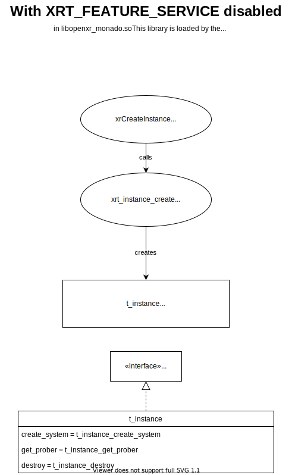
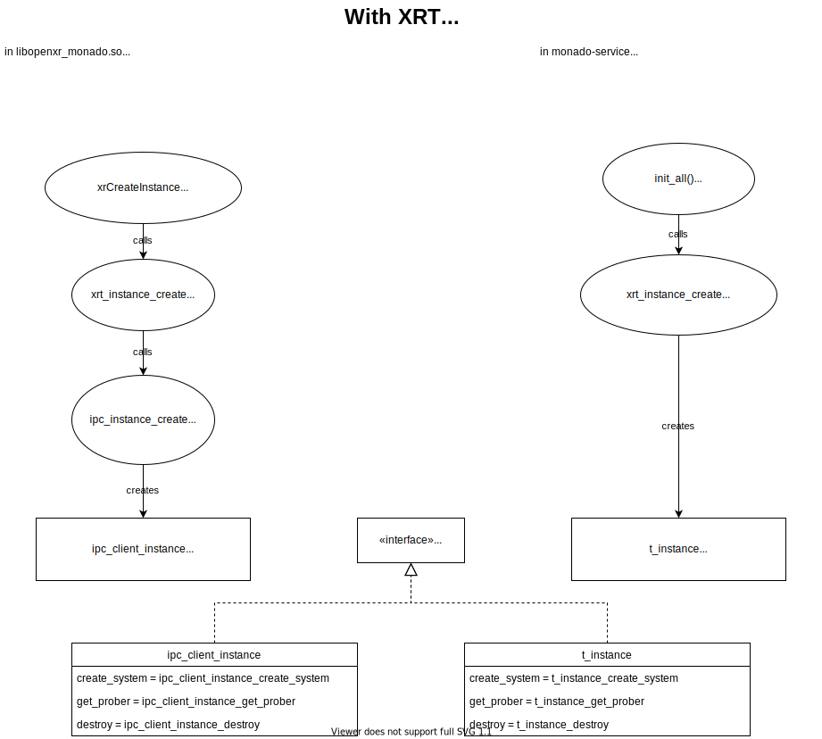

# Understanding and Writing Targets

<!--
Copyright 2018-2020, Collabora, Ltd. and the Monado contributors
SPDX-License-Identifier: BSL-1.0
-->

Monado is designed to be a collection of related but independent modules. The
final build product that brings all the desired components together, potentially
with additional code, is called the "target". There are several targets included
in the Monado source tree (in `src/xrt/targets/`) including:

- `cli` - builds `monado-cli` executable
- `openxr` - builds `libopenxr-monado.so` OpenXR runtime shared object
- `gui` - builds `monado-gui` executable
- `service` - builds `monado-service` executable (if `XRT_FEATURE_SERVICE` is
  enabled)

There is also a directory `common` which builds two static libraries. Because
the "target" is responsible for pulling in all the desired drivers, etc. it can
lead to some repetition if multiple targets want the same driver collection. For
this reason, the "all drivers" code shared between many targets is located here,
though you could consider it a part of the individual targets.

## Requirements of a Target

A target must first provide the entry point desired: `int main()` if it's an
executable, or the well-known symbol name if it's a shared library. In some
cases, the entry point might be provided by one of the modules being combined to
form the target. For instance, an OpenXR runtime must expose
`xrNegotiateLoaderRuntimeInterface`: this function is provided by the OpenXR
state tracker `st_oxr`, so the OpenXR runtime target just has to link the state
tracker in and ensure it is present in the final build product.

Then, the target must provide access to the collection of devices desired.
Target device access is provided by implementing the `xrt_instance` interface in
your target and providing a definition of `xrt_instance_create` that
instantiates your implementation.

All methods of `xrt_instance` are required, though the `get_prober` method may
output a null pointer if the instance is not using a prober, and targets that do
not need compositing may stub out the `create_native_compositor` method to
always return an error. A fully-featured implementation is in
`src/targets/common/target_instance.c`, which calls
`xrt_prober_create_with_lists` passing the common `target_lists` variable to
include all supported devices.

For more detailed information on this interface, see the documentation for @ref
xrt_instance.

## Sample Call Trees

For clarity, call trees are included below for the OpenXR runtime in two general
cases: `XRT_FEATURE_SERVICE` disabled, and `XRT_FEATURE_SERVICE` enabled.

Note that even with `XRT_FEATURE_SERVICE` enabled, the other targets (cli, gui)
more closely resembler the `XRT_FEATURE_SERVICE` disabled diagram: they contain
the device drivers internally rather than contacting the service. They use a
modified version of the in-process target instance without compositor support.

### XRT_FEATURE_SERVICE disabled

This is the simplest architecture. It is also the architecture used by the
various extra targets like `monado-cli` even when building with
`XRT_FEATURE_SERVICE` enabled. (The CLI and GUI link against a slightly modified
version, `target_instance_no_comp`, which stubs out the compositor creation
call, but are otherwise the same.)

### XRT_FEATURE_SERVICE enabled

Note that in this case, there are two processes involved, which have different
`xrt_instance` implementations.

- The runtime has a "stub" or "client proxy" implementation that delegates to
  the service over the IPC.
- The service has a normal or complete instance implementation that actually
  provides access to devices, etc.

